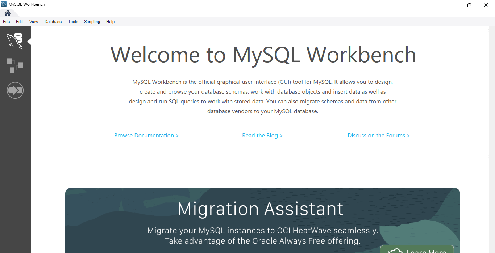
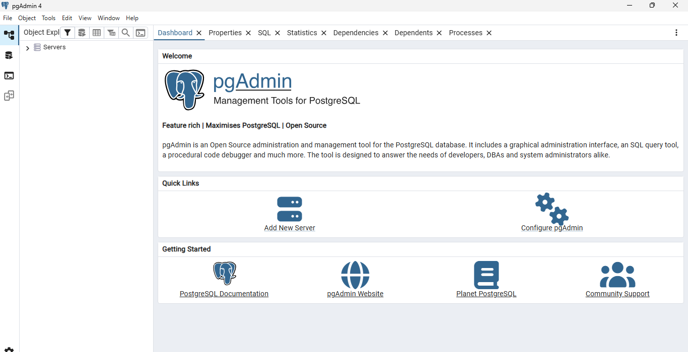
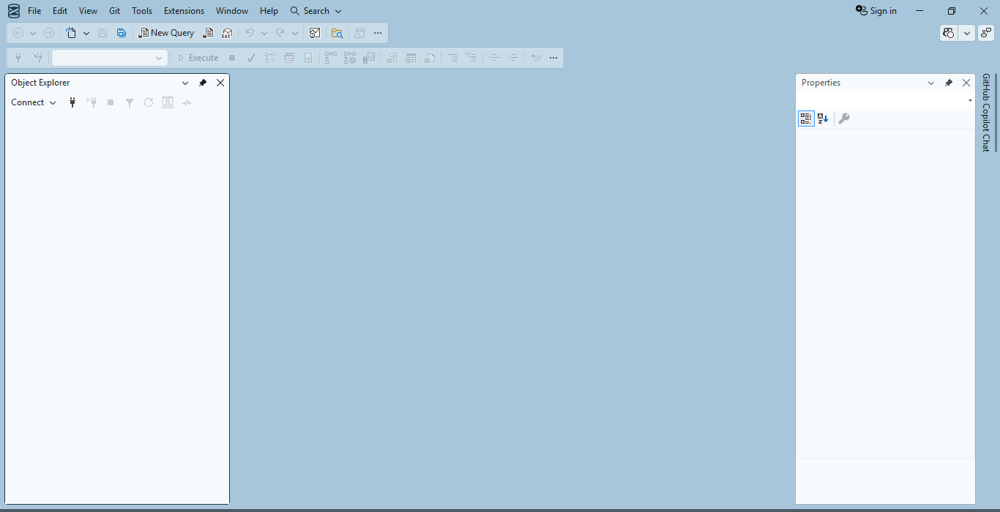
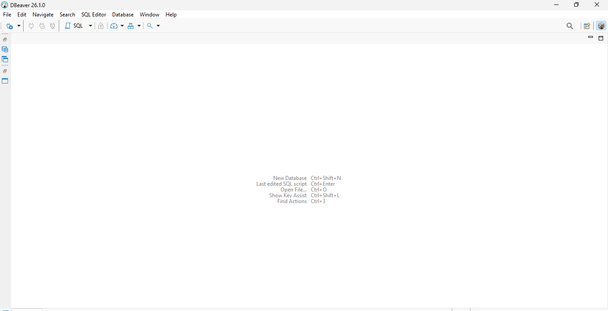
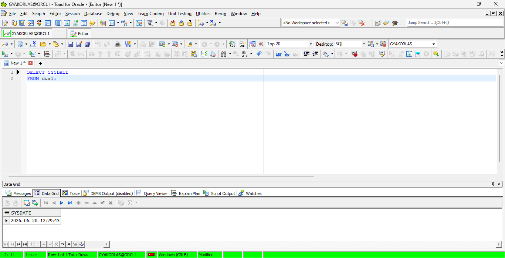
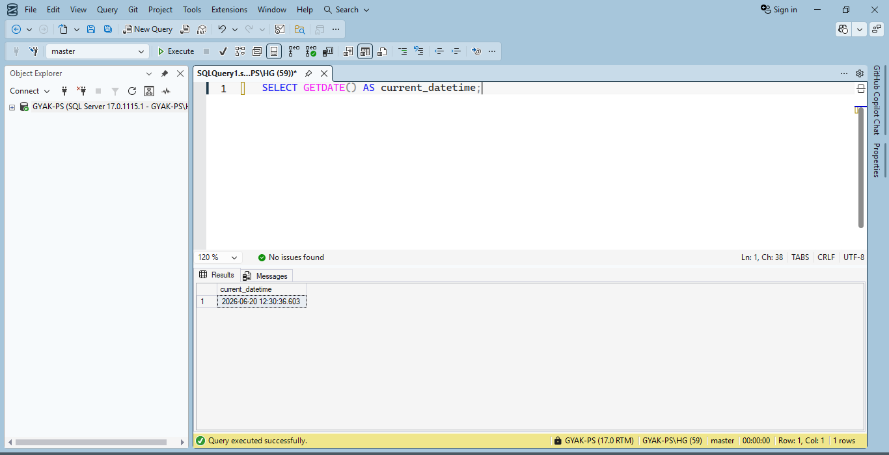
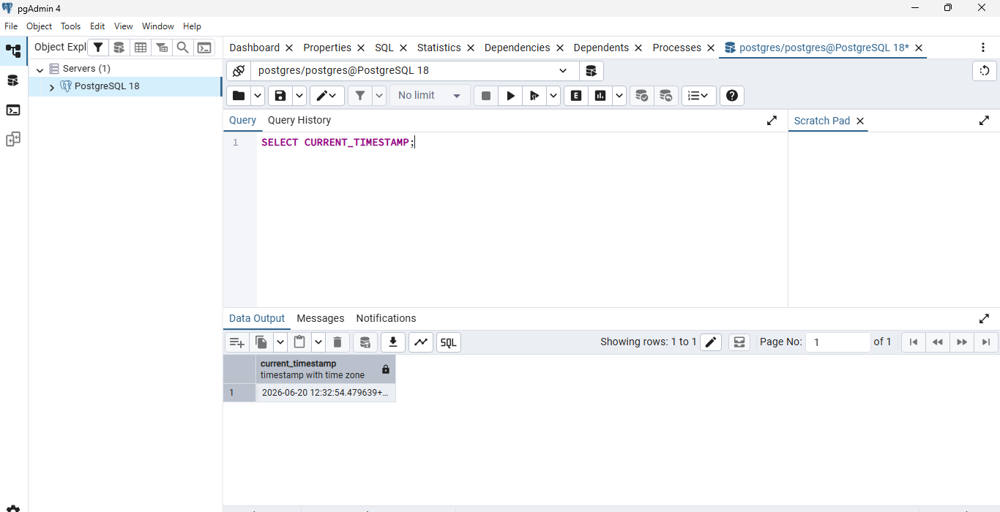
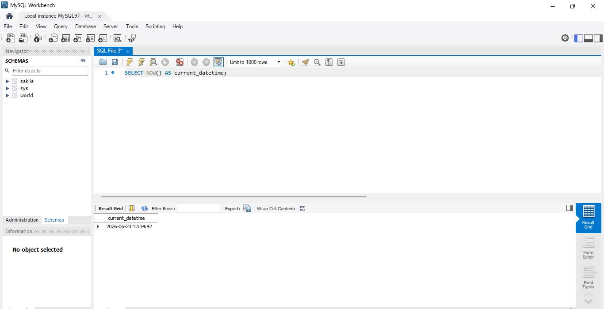
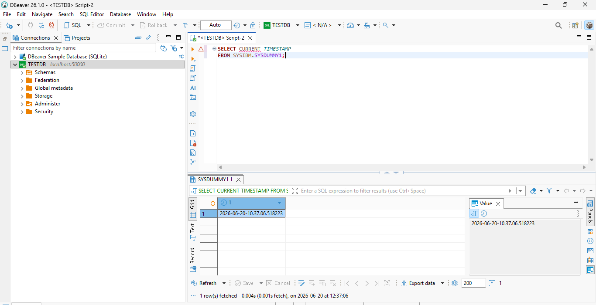
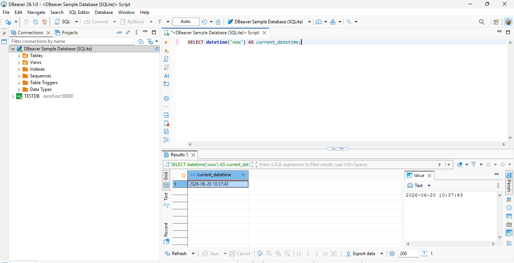

# Eszközök és kapcsolattesztek

Ez a dokumentum a laborban használt adatbázis-kezelő eszközöket és az első kapcsolódási / SQL futtatási teszteket foglalja össze.

A cél ebben a részben nem a telepítési folyamat dokumentálása, hanem annak bemutatása, hogy az adatbázis-kezelő eszközök elindulnak, a kapcsolatok működnek, és minden környezetben végrehajtható egy egyszerű SQL lekérdezés.

## Használt adatbázis-kezelő eszközök

### MySQL Workbench



### Toad for Oracle


### pgAdmin



### SQL Server Management Studio 22



### DBeaver Community



## Kapcsolódási és alap SQL tesztek

Minden adatbázisban egy egyszerű dátum/idő lekérdezés futott le. Ezek a tesztek azt ellenőrzik, hogy az adott klienseszköz sikeresen csatlakozik az adatbázishoz, és képes SQL-t futtatni.

A kapcsolattesztek SQL fájljai itt találhatók:

```text
sql/01_connection_tests/
├── oracle.sql
├── sqlserver.sql
├── postgresql.sql
├── mysql.sql
├── db2.sql
└── sqlite.sql
```

### Oracle Database

```sql
SELECT SYSDATE
FROM dual;
```



### Microsoft SQL Server

```sql
SELECT GETDATE() AS current_datetime;
```



### PostgreSQL

```sql
SELECT CURRENT_TIMESTAMP;
```



### MySQL

```sql
SELECT NOW() AS current_datetime;
```



### IBM Db2

```sql
SELECT CURRENT TIMESTAMP
FROM SYSIBM.SYSDUMMY1;
```



### SQLite

```sql
SELECT datetime('now') AS current_datetime;
```



## Összegzés

Ebben a részben mind a hat adatbázis-környezet működőképesnek bizonyult:

- a klienseszközök elindultak;
- az adatbázis-kapcsolatok létrejöttek;
- mindenhol lefutott egy egyszerű SQL lekérdezés;
- az eredmények képernyőképeken is dokumentálva vannak.
